# CS611-Assignment Legends of Valor

-------------------------------------------------------------
- Name: Azem Kakitaeva, Zhengzheng Tang, Antony Ponomarev
- Email: azemk@bu.edu, zztang@bu.edu, antonyp@bu.edu
- Student ID: U51216906, U07312313, U43948985


## File Structure 

```text
/battle/engine
  BattleEngine.java              // Interface defining the contract for executing battles
  BattleEngineImpl.java          // Implementation of the battle engine handling battle flow

/battle/enums
  EquipChoice.java               // Enum representing possible equipment choices
  HeroActionType.java            // Enum representing available hero actions during battle

/battle/heroAction
  HeroActionStrategy.java        // Strategy interface representing a hero’s chosen action logic
  BattleActionsConfig.java       // Configuration class mapping action types to strategies
  BattleContext.java             // Context class containing shared state for ongoing battles

/battle/heroAction/helper
  LoVRangeUtils.java             // Checks if an attack is within range

/battle/heroAction/impl
  BaseAtttackAction.java         // Handles the basic attacking feature for heroes
  BaseCastSpellAction.java       // Handles the basic spell cast for a hero
  BaseEquipAction.java           // Allows the heroes to equip weapon and armor
  BaseUsePotionAction.java       //Allows the hero to use a potion

/battle/heroAction/impl/mh
  MHAttackAction.java            // Handles the hero attack specifically within monsters and heroes
  MHCastSpellAction.java         // Handles the hero's ability to cast spells specifically within monsters and heroes

/battle/heroAction/impl/lov
  LoVAttackAction.java           // Handles the hero attack specifically within Legends of Valor
  LoVCastSpellAction.java        // Handles the hero's ability to cast spells specifically within Legends of Valor
  MoveAction.java                // Handles the hero's ability to move on the board in Legends of Valor
  RecallAction.java              // Handles the hero's ability to recall back to the nexus
  TeleportAction.java            // Handles the hero's ability to teleport to another hero
  RemoveObstacle.java            // Handles the hero's ability to remove obstacles from the map

/battle/heroAction/impl
  AttackAction.java              // Strategy implementing an attack action
  CastSpellAction.java           // Strategy implementing spell-casting behavior for heroes
  EquipAction.java               // Strategy allowing heroes to equip weapons or armor in battle
  UsePotionAction.java           // Strategy allowing heroes to consume potions during battle

/battle/menu
  BattleMenu.java                // Interface defining battle-related UI display operations
  BattleMenuImpl.java            // Implementation of BattleMenu interface

/game
  Game.java                      // Interface defining main game methods
  GameCommand.java               // Enum mapping keyboard commands to game actions
  GameImpl.java                  // Handles the game loop of Heroes and Monsters
  GameLauncher.java              // Entry class responsible for loading resources, selecting between games, and running the game
  LegendsOfValorGameImpl.java    // Handles the game loop of Legends of Valor

/hero/enums
  HeroSkill.java                 // Enum representing hero skill categories
  HeroType.java                  // Enum representing hero types

/hero
  Hero.java                      // Abstract base class defining shared hero attributes and behavior
  Inventory.java                 // Class managing a hero’s inventory
  Paladin.java                   // Subclass of Hero representing the Paladin hero type
  Party.java                     // Class representing the player's active group of heroes
  Sorcerer.java                  // Subclass of Hero representing the Sorcerer hero type
  Wallet.java                    // Class representing a hero’s gold amount 
  Warrior.java                   // Subclass of Hero representing the Warrior hero type

/market/command
  MarketAction.java              // Enum representing available market menu operations
  MarketCommand.java             // Command interface defining a market action executable by a hero
  MarketCommandConfig.java       // Configuration mapping MarketAction values to command implementations

/market/model
  Market.java                    // Class representing a market and its available items

/market/model/item
  Armor.java                     // Subclass of Item representing defensive armor
  Item.java                      // Abstract base class representing a generic market item
  ItemType.java                  // Enum defining item categories
  Potion.java                    // Subclass of Item representing a consumable potion
  Spell.java                     // Subclass of Item representing castable magical spells
  SpellType.java                 // Enum defining categories of spells
  StatType.java                  // Enum representing hero statistics affected by items
  Weapon.java                    // Subclass of Item representing weapon

/market/service
  MarketFactory.java             // Factory class responsible for constructing Market instances
  MarketService.java             // Interface defining market operations
  MarketServiceImpl.java         // Implementation of business logic for market operations

/market/ui
  MarketMenu.java                // Interface defining display operations for the market UI
  MarketMenuImpl.java            // Console implementation of the market interaction menu

/monster/enums
  MonsterAttribute.java          // Enum representing monster attributes

/monster
  Dragon.java                    // Subclass of Monster representing a Dragon 
  Exoskeleton.java               // Subclass of Monster representing an Exoskeleton 
  Monster.java                   // Abstract base class defining core monster attributes and behavior
  MonsterFactory.java            // Factory class generating monsters for battles
  Spirit.java                    // Subclass of Monster representing a Spirit

/upload/base
  GenericFileLoader.java         // Generic loader for building objects from uploaded text files
  LineMapper.java                // Functional mapper converting a text line into an object
  TextFileUtils.java             // Utility class for reading and parsing text files

/upload
  ArmorFileLoader.java           // Loader class for constructing Armor objects from file data
  HeroFileLoader.java            // Loader class for constructing Hero objects from file data
  MonsterFileLoader.java         // Loader class for constructing Monster objects from file data
  PotionFileLoader.java          // Loader class for constructing Potion objects from file data
  SpellFileLoader.java           // Loader class for constructing Spell objects from file data
  WeaponFileLoader.java          // Loader class for constructing Weapon objects from file data

/utils
  ConsoleColors.java             // ANSI color definitions enabling styled console output
  ConsoleIOUtils.java            // Implementation of IOUtils interface
  GameConstants.java             // Centralized constants for game 
  IOUtils.java                   // Utility interface for handling generic input/output operations
  MessageUtils.java              // Repository for centralized UI text messages
  EndOfInputException.java       // Custom exception for handling EOF gracefully
  BGMPlayer.java                 // Background music player for in-game audio (WAV format)
  RangeConstants.java            // Constants for attack ranges by hero class and monster type

/ui/formatter
  LegendsMapFormatter.java       // Block-style colored map renderer for Legends of Valor
  LineKind.java                  // Enum for categorizing rendered line types
  RenderedLine.java              // Data class for formatted console output lines
  StatusBarRenderer.java         // Progress bar renderer using ASCII/Unicode characters
  HeroStatusFormatter.java       // Formatter for hero status panels (HP/MP/equipment)
  MonsterStatusFormatter.java    // Formatter for monster status panels (HP/stats)

/combat
  RangeCalculator.java           // Utility for calculating effective attack ranges

/entity
  GamePiece.java                 // Common interface for Hero and Monster positioning

/worldMap/enums
  Direction.java                 // Enum representing movement directions on the world map
  TileType.java                  // Enum defining categories of map tiles

/worldMap
  MarketTileFeature.java         // Feature class marking a tile as containing a market
  Tile.java                      // Class representing a single grid cell of the world map
  TileFeature.java               // Abstract base class for map tile features
  WorldMap.java                  // Extends the MonstersAndHeroesWorldMap.java to keep compatibility with previous version
  MonstersAndHeroesWorldMap.java // Implementation of the world map for Monsters and Heroes
  LegendsOfValorWorldMap.java    // Implements the world map for Legends of Valor with 3-lane grid and entity management
  IWorldMap.java                 // General interface for creating world maps for different games
  ILegendsWorldMap.java          // Extended interface for Legends of Valor specific map operations

/worldMap/feature
  BushFeature.java               // Handles the bushes on the map, extends TerrainBonusFeature
  CaveFeature.java               // Handles the caves on the map, extends TerrainBonusFeature
  KouloFeature.java              // Handles the Koulou's on the map, extends TerrainBonusFeature
  NexusFeature.java              // Handles the Nexus's on the map
  TerrainBonusFeature.java       // Abstract class that can be implemented by bush/cave/koulo that gives heroes stats boosts
```


## Design Decisions 

* **Strong Object-Oriented Architecture**
  The game is built around clean OOP principles with abstract base classes (`Hero`, `Monster`, `Item`) and well-structured subclasses. This makes the system highly extendable and easy to maintain.

* **Use of Key Design Patterns**

    * **Factory Pattern**:
    *   `MonsterFactory` loads template monsters from files and dynamically generates battle-ready monsters scaled to the party level.
    *   `LegendsOfValorGameFactory` and `MonstersAndHeroesGameFactory`: Concrete factory instances that create the specified game. They both implmenet the abstract interface: `GameFactory`
    * **Abstract Factory Pattern**: `GameFactory` Interface for creating concrete factories for each unique game type.
    * **Strategy Pattern**: `HeroActionStrategy` encapsulates hero actions (attack, spell, potion, equip, skip) into separate strategy objects, making new actions easy to add.
    * **Command Pattern**: `MarketCommand` defines executable market actions (buy, sell, view info, leave) and allows clean, modular menu behavior.

* **SOLID Principles**

    * Each class has a single purpose (Single Responsibility Principle).
    * New monsters, heroes, items or commands can be added without modifying existing code (Open-Closed Principle).
    * Interfaces decouple components, enabling flexible swapping of implementations (Dependency Inversion Principle).

* **Clear Separation of Concerns**

    * **Model Layer**: Hero, Monster, Item hierarchy, Market, WorldMap, Party.
    * **Logic Layer**: BattleEngine, HeroActionStrategy, MonsterFactory, MarketService, MarketCommand.
    * **Infrastructure Layer**: File loaders (`upload.*`), RuleConstants, ConsoleColors, IOUtils, centralized MessageUtils.
      This structure makes the codebase easy to understand, test and extend.

* **Scalable & Extensible Design**
    * A GUI or web interface could be built on top of the existing logic.
    * New hero classes, monster types, spells, items or commands can be added simply by adding new files or subclasses.
    * The system supports easy localization, since all user-facing text is centralized in MessageUtils.


* **Enhanced Console UI with Color Output & Visual Formatting**
  - Block-style colored cells (4 chars × 2 lines) for Legends of Valor map
  - ANSI background colors distinguish different terrain types
  - Progress bars (HP/MP) using Unicode characters (█░)
  - Clear hero/monster identification (H1, H2, H3, M1, M2, M3)
  - Professional formatting with battlefield headers and lane labels

* **Background Music Support**
  - Non-blocking audio playback using `BGMPlayer` on daemon thread
  - Supports WAV format (BGM.wav)
  - Gracefully handles missing audio files without affecting gameplay

* **Centralized Game Rules & UI Messages**

    * `GameConstants` holds all game constants.
    * `MessageUtils` centralizes all UI messages for consistency and future localization.

* **Comprehensive JavaDoc Documentation**
The entire codebase includes detailed JavaDoc for classes, interfaces, methods, and enums.
This improves readability, explains design intent and makes the system easier to maintain and extend. 


## Object-Oriented Design in Legends of Valor

### Core OOP Principles

#### 1. Encapsulation
- **Private data members** with public getters/setters (e.g., `Hero.hp`, `Monster.baseDamage`)
- **Internal state protection**: `LegendsOfValorWorldMap` encapsulates position tracking in private `Map<Hero, int[]>` and `Map<Monster, int[]>`
- **Data hiding**: Tile terrain bonuses are queried via methods, not exposed as public fields
- **Access control**: `GamePiece` interface exposes only necessary position methods, hiding implementation details

#### 2. Inheritance
- **Abstract base classes**: `Hero`, `Monster`, `Item`, `TerrainBonusFeature`
- **Concrete subclasses**: 
  - Hero types: `Warrior`, `Sorcerer`, `Paladin` extend `Hero`
  - Monster types: `Dragon`, `Spirit`, `Exoskeleton` extend `Monster`
  - Terrain features: `BushFeature`, `CaveFeature`, `KoulouFeature` extend `TerrainBonusFeature`
- **Code reuse**: Common behavior (level-up, damage calculation) implemented once in base class
- **Specialization**: Subclasses override `getFavoredSkills()` and `getFavoredAttributes()` to customize behavior

#### 3. Polymorphism
- **Interface-based**: `GamePiece` allows `LegendsOfValorWorldMap` to treat `Hero` and `Monster` uniformly
- **Runtime polymorphism**: `HeroActionStrategy` interface enables different action behaviors via `execute()` method
- **Substitutability**: Any `TileFeature` subclass can be attached to a `Tile` and provide terrain bonuses
- **Factory returns interfaces**: `GameFactory.createGame()` returns `Game` interface, hiding concrete implementations

---

### Design Patterns Applied

#### Strategy Pattern
**Used in**: Hero actions during battle
- **Context**: `LegendsOfValorGameImpl` needs to execute various hero actions
- **Strategy Interface**: `HeroActionStrategy` with `execute()` method
- **Concrete Strategies**: `MoveAction`, `TeleportAction`, `RecallAction`, `LoVAttackAction`, `RemoveObstacle`
- **Configuration**: `BattleActionsConfig` maps `HeroActionType` enum to strategies
- **Benefit**: Adding new actions (e.g., `RemoveObstacle`) requires only a new strategy class, no modification to existing code

#### Factory Pattern
**Used in**: Monster creation and game initialization
- **MonsterFactory**: Loads monster templates from files and generates battle-ready instances scaled to party level
- **Purpose**: Separates monster creation logic from monster behavior
- **Benefit**: Centralized monster instantiation, easy to adjust spawning rules

#### Abstract Factory Pattern
**Used in**: Game mode creation
- **Abstract Factory**: `GameFactory` interface with `createGame()` method
- **Concrete Factories**: 
  - `LegendsOfValorGameFactory` creates LOV game with 3-lane map
  - `MonstersAndHeroesGameFactory` creates MH game with random exploration map
- **Benefit**: GameLauncher doesn't need to know game-specific construction details, just calls factory

#### Decorator Pattern
**Used in**: Tile features for terrain effects
- **Component**: `Tile` class
- **Decorator**: `TileFeature` abstract class
- **Concrete Decorators**: `NexusFeature`, `BushFeature`, `CaveFeature`, `KoulouFeature`
- **Enhancement**: Features add behavior (market access, stat bonuses) to tiles without modifying Tile class
- **Benefit**: Tiles can have multiple features attached dynamically

#### Template Method Pattern
**Used in**: Hero and Monster base classes
- **Template Class**: `Hero` abstract class
- **Template Method**: `levelUp()` calls abstract `getFavoredSkills()` to determine which stats to boost
- **Hook Methods**: 
  - `Hero.getFavoredSkills()` - overridden by Warrior/Sorcerer/Paladin
  - `Monster.getFavoredAttributes()` - overridden by Dragon/Spirit/Exoskeleton
- **Benefit**: Common level-up logic in one place, subclasses only define their specialization

#### Composition Over Inheritance
**Used in**: NexusFeature and Market relationship
- **Instead of**: `NexusFeature extends Market` (tight coupling)
- **We use**: `NexusFeature` has a `Market` field (composition)
- **Benefit**: NexusFeature can change Market implementation, avoid deep inheritance hierarchies

---

### SOLID Principles Demonstrated

- **Single Responsibility**: `LegendsMapFormatter` only renders maps, `LegendsOfValorGameImpl` only orchestrates game loop
- **Open-Closed**: New hero actions can be added without modifying existing strategy classes
- **Liskov Substitution**: Any `Hero` subclass can replace `Hero` in game logic
- **Interface Segregation**: `GamePiece` defines only essential methods (position, alive status)
- **Dependency Inversion**: `LegendsOfValorGameImpl` depends on `BattleMenu` interface, not `BattleMenuImpl` concrete class


## Steps to Run

1. Download the `src` folder and `BGM.wav` (optional, for background music).
2. Open terminal/command prompt and navigate to the project folder:
```bash
cd path/to/oop_monsters_and_heroes
```
3. Compile the code:
```bash
javac -encoding UTF-8 -d out $(find src -name "*.java")
```
4. Run the game:
```bash
java -cp out Main
```

**Note on Background Music:**
- Place `BGM.wav` in the project root directory for in-game music
- Java AudioSystem requires WAV format (MP3 is not supported)
- If BGM file is missing, the game continues without music


## Game Flow
| Screen 1                                       | Screen 2                                       | Screen 3                                       |
|------------------------------------------------|------------------------------------------------|------------------------------------------------|
| 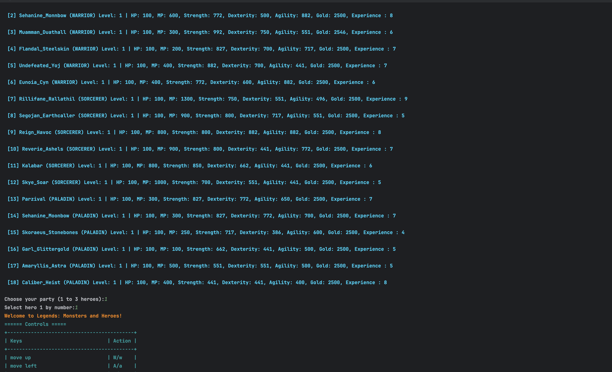 | 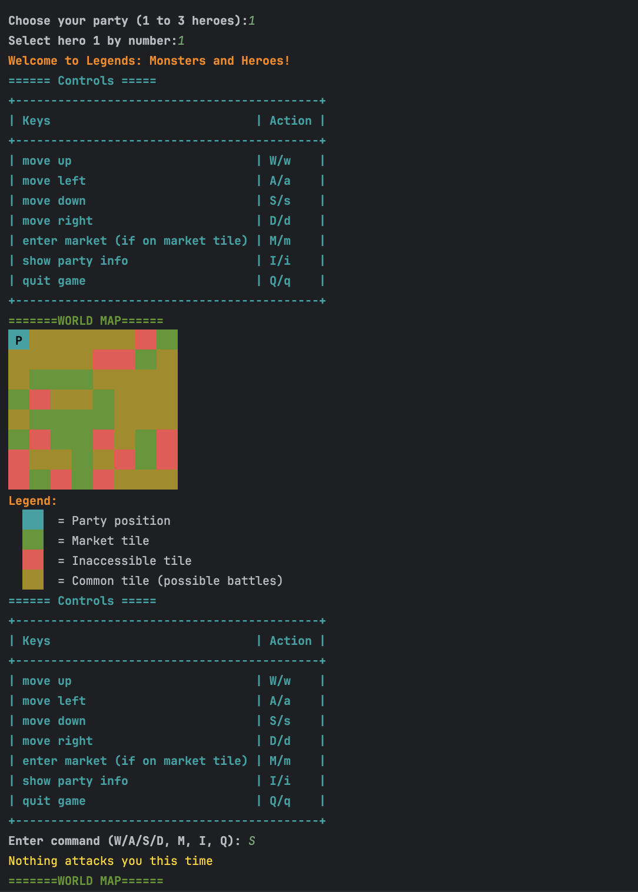 | 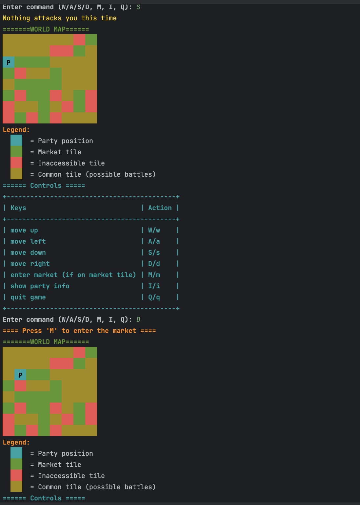 |

| Screen 4                                       | Screen 5                                       | Screen 6                                       |
|------------------------------------------------|------------------------------------------------|------------------------------------------------|
| 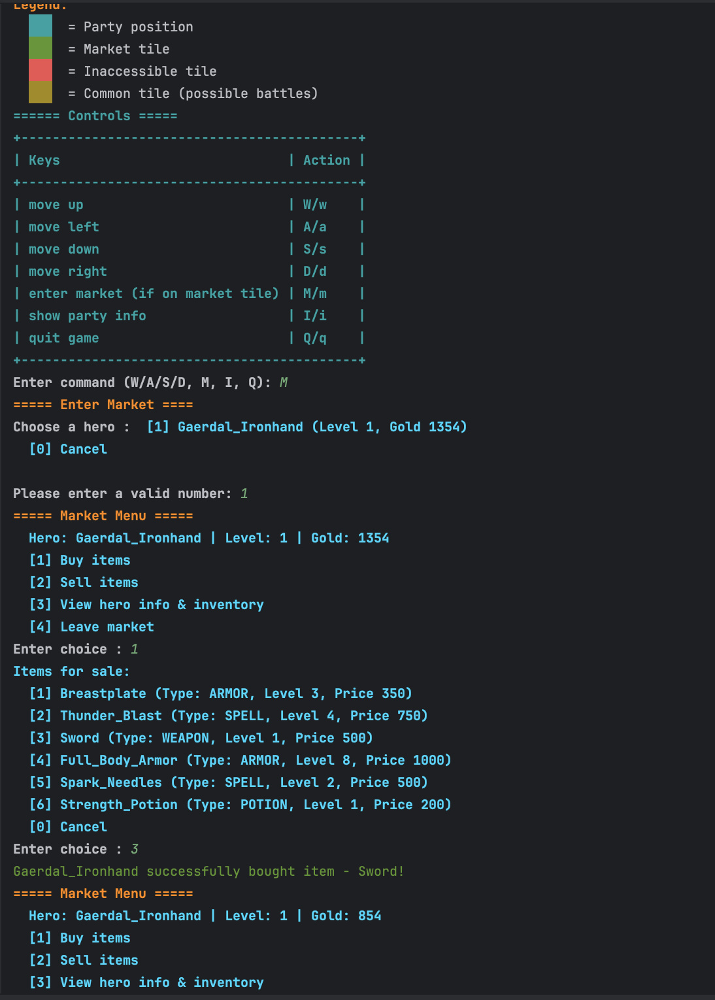 | 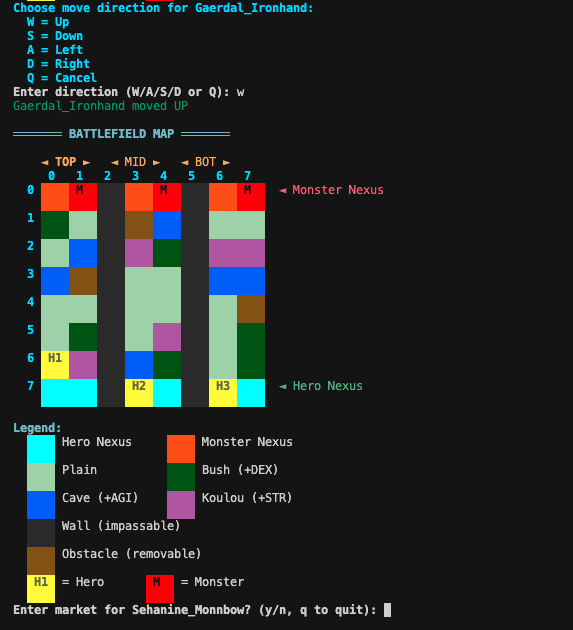 | 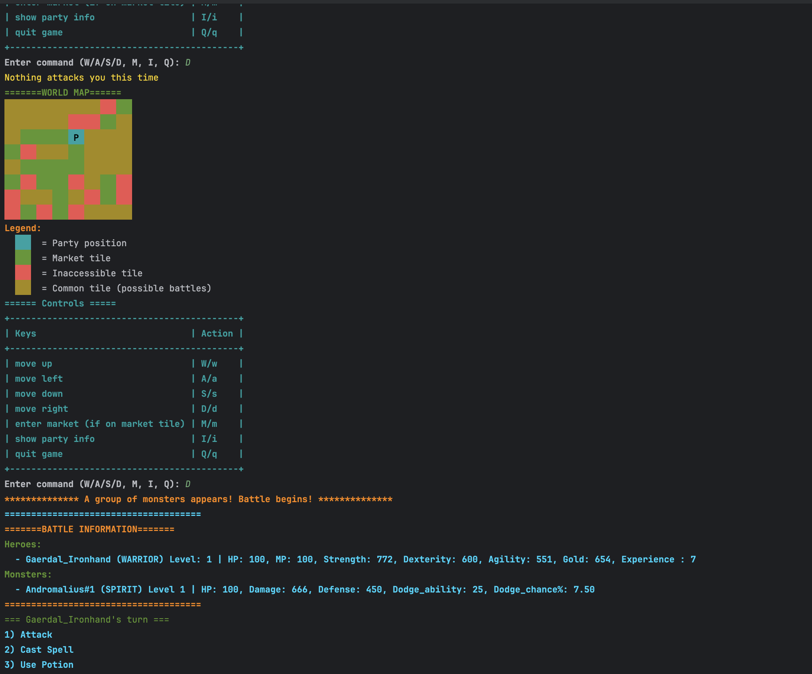 |

| Screen 7                                       | Screen 8                                       | Screen 9                                       |
|------------------------------------------------|------------------------------------------------|------------------------------------------------|
| 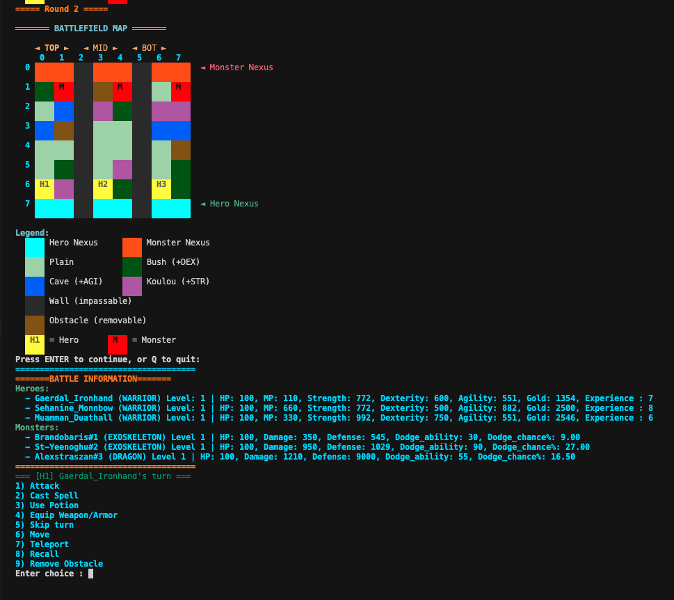 | 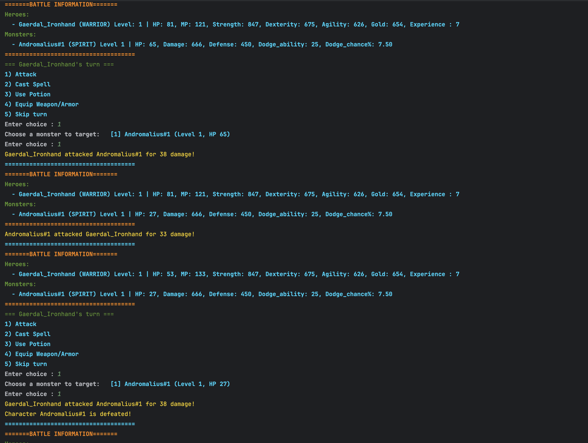 |  |

| Screen 10                                       | Screen 11                                       | Screen 12                                       |
|------------------------------------------------|------------------------------------------------|------------------------------------------------|
| 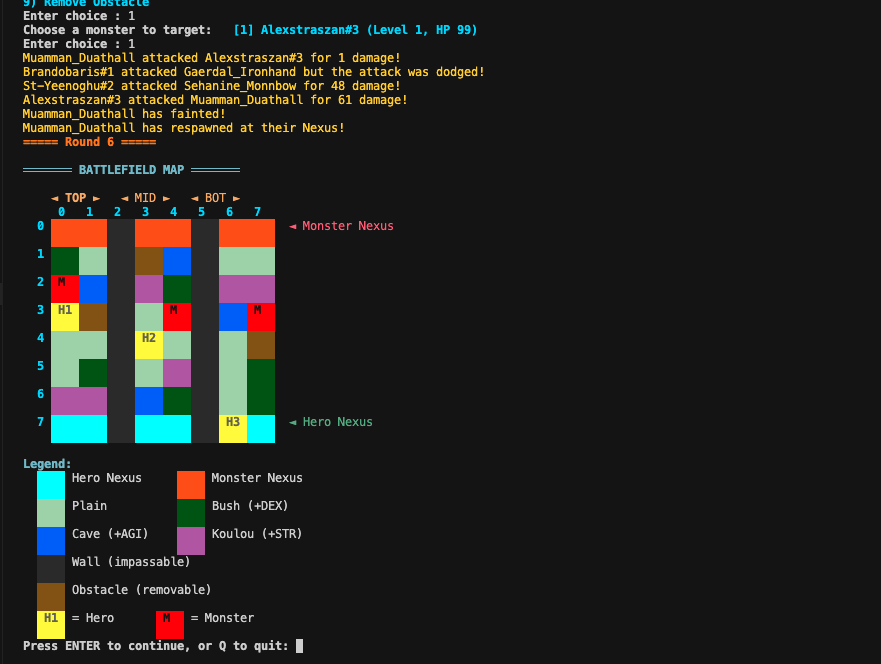 | 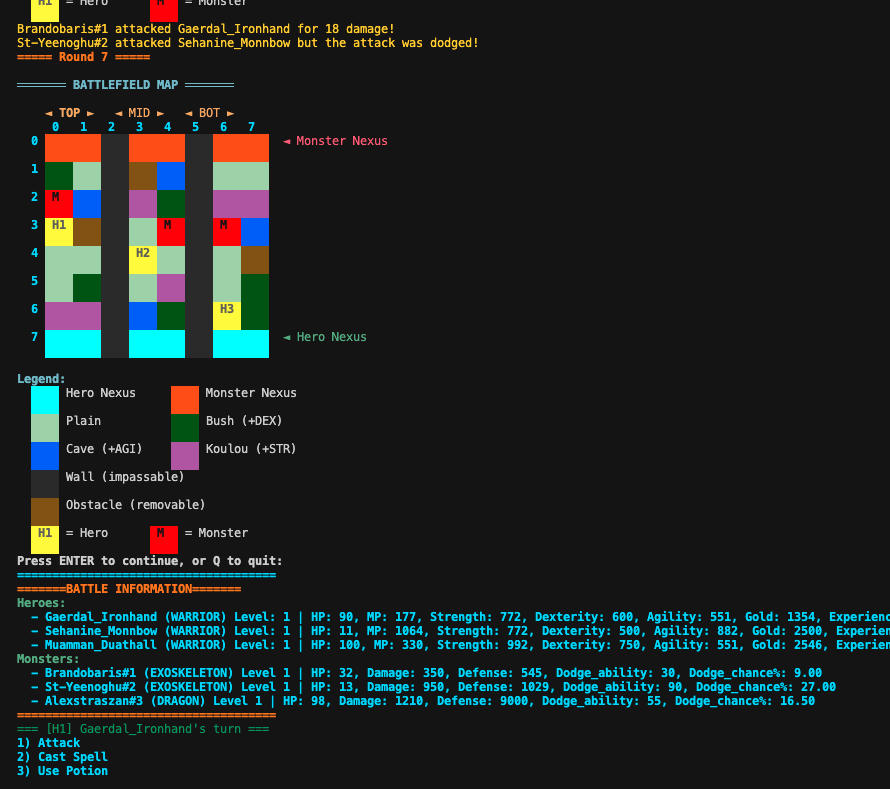 | 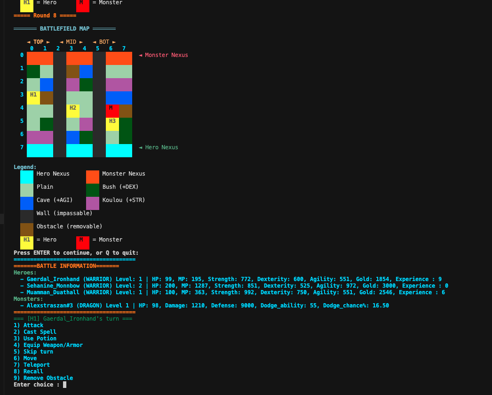 |

| Screen 13                                       | Screen 14                                       |
|------------------------------------------------|------------------------------------------------|
|  | 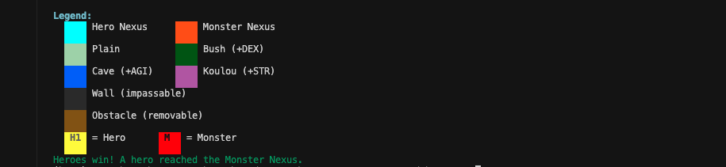 |
